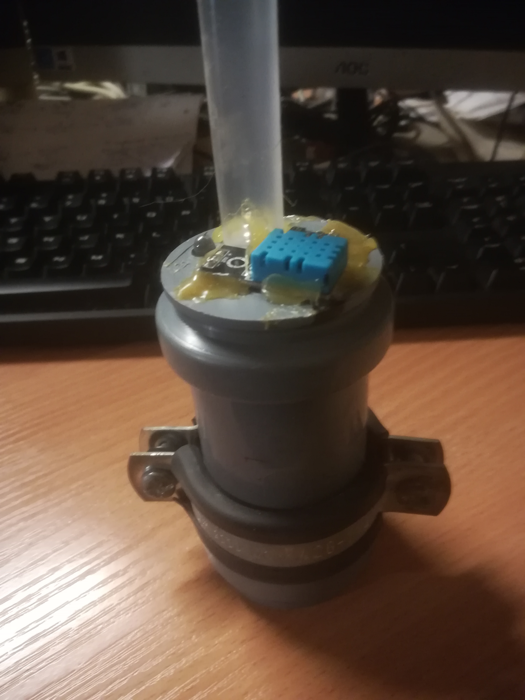
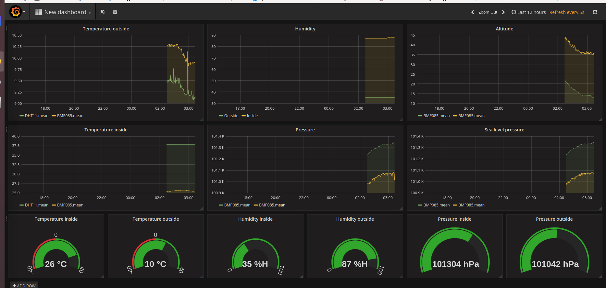
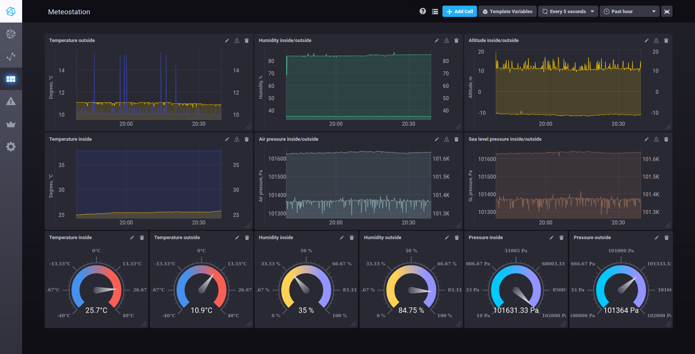

# MeteoStation
Wireless weather stations with server for visualizing weather data.

### Stack:

- Arduino/C, NodeMCU, ESP8266, BMP085, DHT11
- Java8, SpringBoot, SpringData
- InfluxDB
- GraphQL
- Grafana, Chronograf

 <!-- .element height="50%" width="50%" -->
 <!-- .element height="50%" width="50%" -->
 <!-- .element height="50%" width="50%" -->

